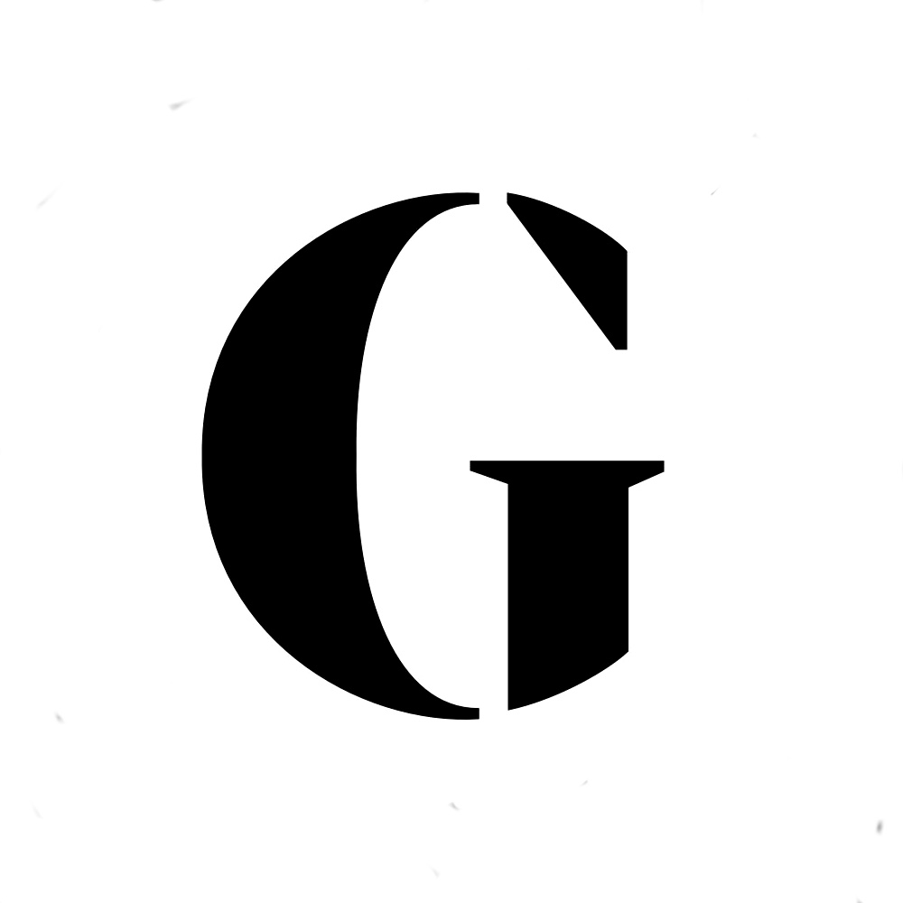

### The Guardian Icon as Fourier sum



Your mission, should you choose to accept it, is to draw the above icon, more precisely the contour of the black area, using a Fourier sum.

The basic functions you will be using are the following unit vectors

```
e : Nat -> [0, 2\pi] -> Complex
e(n)(t) = e^{int} = cos(nt) + i sin(nt)
```

where `Nat` is the set of all natural integers, `Complex` the set of complex numbers, and `i` the unit complex number ( of coordinates (0,1) ).

The challenge is to find a (finite sequence) of complex coefficients `a_{1}, a_{2}, ...., a_{k}` such that the following function `f`

```
f: [0, 2\pi] -> Complex
t -> a_{1}e(1)(t) + a_{2}e(2)(t) + .... + a_{k}e(k)(t)
```

draws the Guardian logo. You may put together a webpage that shows the drawing.

